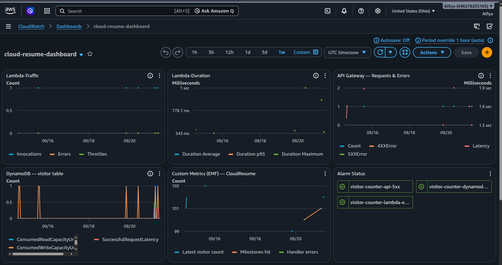
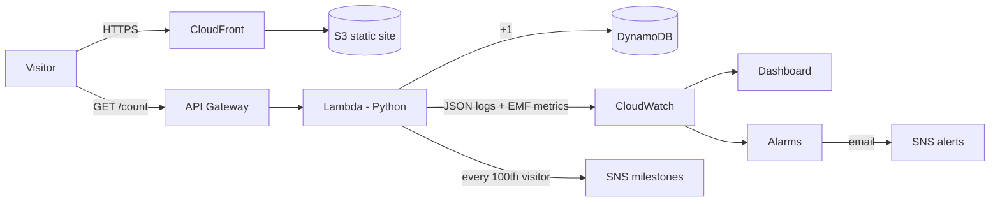
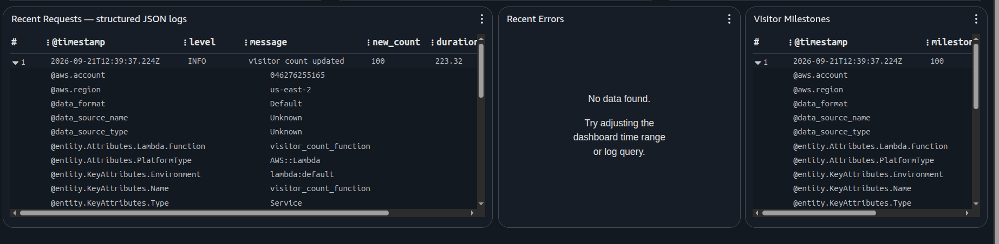
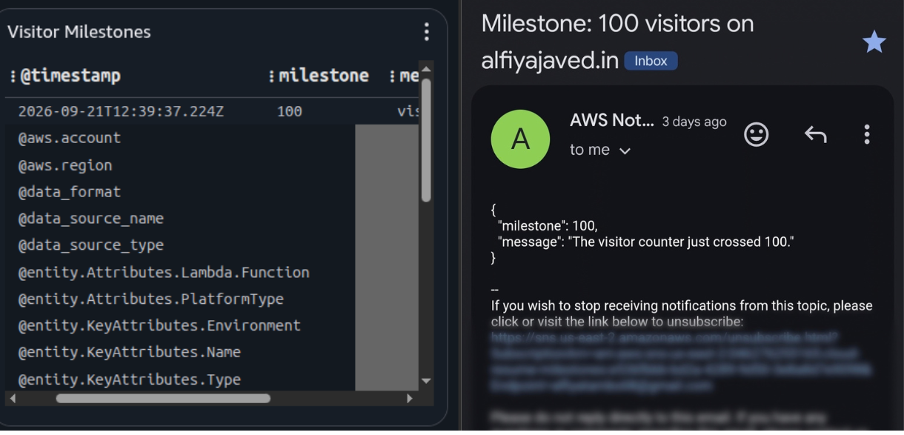
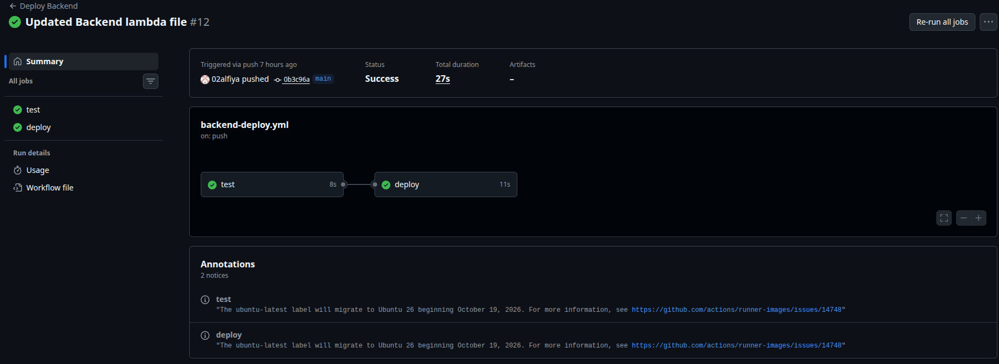

# Cloud Resume Challenge — Serverless Portfolio on AWS


> **Summary:** A portfolio site that must count visitors in real time, redeploy itself on
> every git push, and tell me within minutes when something breaks — built on AWS serverless
> (S3, CloudFront, Lambda, API Gateway, DynamoDB), defined entirely in Terraform, delivered
> by GitHub Actions with OIDC, and observable through structured JSON logging, EMF custom
> metrics, a CloudWatch dashboard, and SNS alarms — for under $1/month.

**Live site:** [alfiyajaved.in](https://alfiyajaved.in) · **Build log:** [alfiyajaved.hashnode.dev](https://alfiyajaved.hashnode.dev)

Started as the [Cloud Resume Challenge](https://cloudresumechallenge.dev/). The observability
layer is what I added beyond it — after a real outage taught me the difference between
"it works" and "I can prove it works."




---


## ✨ Features

### Core — the challenge

| Feature | How |
|---|---|
| Static hosting | Private S3 behind CloudFront (Origin Access Control), Route 53, HTTPS via ACM |
| Visitor counter | API Gateway → Python Lambda → DynamoDB, atomic server-side increment |
| Infrastructure as Code | Every resource in Terraform — no console-built infrastructure in the critical path |
| CI/CD | GitHub Actions; tests gate the backend; OIDC, zero stored credentials |
| Security | Least-privilege IAM (one DynamoDB action, one SNS ARN), TLS 1.2+, CORS pinned to the domain |

### Beyond the challenge ⭐

| Feature | What it does |
|---|---|
| ⭐ Structured JSON logging | Every Lambda log line is valid JSON with a level, request ID, count, and duration. CloudWatch can search these fields like a database. |
| ⭐ CloudWatch dashboard | One page with live graphs: traffic, errors, duration, DynamoDB activity, custom metrics, and recent logs. |
| ⭐ SNS error alerts | Email alarms for Lambda errors, DynamoDB throttles, API Gateway 5xx, and monthly billing over $2. |
| ⭐ Milestone logging | Every 100th visitor triggers a log entry, a custom metric, an email to me, and a small 🎉 message on the site. |
| ⭐ Modern UI | Clean CSS design, an animated terminal card that replays a deployment, and support for reduced-motion settings. |

---


## 🏗 Architecture


1. CloudFront serves the site from the private S3 origin (signed OAC requests only).
2. The page calls `GET /count` — dynamic, so it bypasses CloudFront entirely.
3. Lambda increments DynamoDB with an atomic `ADD` (no read-modify-write race), logs JSON,
   emits EMF metrics, and returns the count.
4. CloudWatch turns logs into metrics, metrics into graphs, and breaches into emails.

---

## 🧰 Tech Stack

| Area | Technology |
|---|---|
| Frontend | HTML, CSS, vanilla JavaScript |
| Backend | Python 3.14, boto3 |
| Database | DynamoDB (pay-per-request) |
| IaC | Terraform (dual-region providers) |
| CI/CD | GitHub Actions + AWS OIDC (keyless) |
| Observability | CloudWatch Logs, EMF, Dashboard, Alarms, SNS |
| Testing | Python `unittest` with mocked AWS calls |


---


## 📏 Success Metrics

Every number below is measured, with the command that reproduces it.
*(Mapped to the four DORA metrics where applicable.)*

| Metric | Target | Measured | How to reproduce |
|---|---|---|---|
| Routine infra deploy (`terraform apply`, small change) | ≤ 90 s | **0m26.317s avg (n=3, [21/09/2026])** | `time terraform apply -auto-approve` ×3, average `real` |
| Fresh rebuild (empty → full stack) | ≤ 25 min | **~15-20 min** (initial build) | One-time; dominated by ACM validation + CloudFront |
| Frontend lead time (push → live) | ≤ 60 s | **16 s** | GitHub Actions run history, avg of last 5 |
| Backend lead time (push → Lambda updated, incl. tests) | ≤ 2 min | **21.8 s** | GitHub Actions run history, avg of last 5 |
| MTTD — error → alarm email | ≤ 5 min | **≤ 5 min** by design | Alarm period 300 s × 1 evaluation |
| MTTR — detection → fix live | ≤ 30 min | **[X] min** (real incident) | Incident timeline in build log |
| Log fidelity (application lines as JSON) | 100% | **100%** | Insights query below |
| False alarms | 0 / 30 days | **0** | Inbox, last 30 days |
| Metric freshness (invocation → datapoint) | < 2 min | ~1 min | EMF async extraction, observed |
| Monthly cost | < $1 | **$0.59** | AWS bill + $2 ceiling alarm |

Log fidelity check:

```text
SOURCE '/aws/lambda/visitor_count_function'
| stats count(*) as total_lines, sum(ispresent(level)) as structured_lines
```

(Application lines only — Lambda's platform `START`/`END`/`REPORT` lines are excluded by design.)

---

## 📊 Observability in Detail

### Structured JSON logging

Every log line is one JSON object, so Logs Insights treats the log group like a queryable table:

```json
{
  "timestamp": "2026-09-21T10:15:30.123+00:00",
  "level": "INFO",
  "service": "visitor-counter",
  "message": "visitor count updated",
  "request_id": "a1b2c3d4",
  "new_count": 101,
  "previous_count": 100,
  "duration_ms": 38.2,
  "cold_start": false
}
```

### Custom metrics via EMF

Metrics ride inside the log lines (Embedded Metric Format) — CloudWatch extracts them
asynchronously. No `PutMetricData` call, no extra latency, no extra IAM permission,
and the first 10 custom metrics are free.

### Alarms

| Alarm | Watches | Period |
|---|---|---|
| `visitor-counter-lambda-errors` | Any Lambda error | 5 min |
| `visitor-counter-dynamodb-throttles` | Throttled requests | 5 min |
| `visitor-counter-api-5xx` | API Gateway server errors | 5 min |
| `monthly-billing-alert` | Estimated charges > $1(us-east-1) | 6 h |

` treat_missing_data = "notBreaching"` keeps a low-traffic site from flapping —
quiet is normal, an error is not.

### Milestones

Every 100th visitor triggers four signals at once: a JSON log entry, a `VisitorMilestone`
metric, an SNS email to me, and a 🎉 toast in that visitor's browser. The step is one
Terraform variable (`milestone_step`), and the backend is the single source of truth —
the frontend only reacts to what the API tells it.

---

## CI/CD

| Push to… | Workflow | Does |
|---|---|---|
| `Frontend/**` | Deploy Frontend | Sync to S3 → invalidate CloudFront |
| `Backend/**` | Deploy Backend | Run unit tests → update Lambda code (tests gate the deploy) |

Both pipelines assume a role via **OIDC federation** — GitHub receives short-lived
credentials per run. No access keys exist anywhere in the repo or GitHub settings.

---

## Project Structure
 
```
.
├── Frontend/
│   ├── index.html          # the page
│   ├── style.css           # all styling
│   ├── visitor.js          # counter + milestone toast
│   └── terminal.js         # animated terminal card
├── Backend/
│   ├── lambda_function.py  # counter + logging + metrics + milestones
│   └── test_lambda.py      # unit tests with mocks
├── Terraform/
│   ├── providers.tf        # AWS providers (two regions)
│   ├── main.tf             # core resources: S3, DynamoDB, Lambda, API, CloudFront...
│   ├── observability.tf    # dashboard, log group, alarms, milestone topic
│   ├── variables.tf        # input values
│   └── outputs.tf          # URLs and names after apply
└── .github/workflows/
    ├── deploy-frontend.yml
    └── deploy-backend.yml
```

---
## Screenshots

| | |
|---|---|
|  |  |
| *Dashboard: service + custom metrics, alarms, live log tables* | *Logs Insights: JSON fields queried like a table* |
|  |  |
| *Milestone #100: toast on site + email in inbox* | *CI: tests gate every backend deploy* |
 
---

## Prerequisites
 
Install the following before deploying this project.
 
### Python
 
Python 3.14 is required, to match the Lambda runtime. Create and activate a virtual environment before running any Python commands:
 
```bash
python3 -m venv venv
source venv/bin/activate      # Linux / Mac
venv\Scripts\activate         # Windows
```
 
No external packages are required to run the tests, since boto3 is mocked directly inside the test file. If real dependencies are added later, list them in a `requirements.txt` file.
 
### Terraform
 
Terraform reads AWS credentials through the AWS CLI's profile system, so AWS CLI should be configured before Terraform is used.
 
```bash
sudo apt update && sudo apt install -y gnupg software-properties-common
wget -O- https://apt.releases.hashicorp.com/gpg | sudo gpg --dearmor -o /usr/share/keyrings/hashicorp-archive-keyring.gpg
echo "deb [signed-by=/usr/share/keyrings/hashicorp-archive-keyring.gpg] https://apt.releases.hashicorp.com $(lsb_release -cs) main" | sudo tee /etc/apt/sources.list.d/hashicorp.list
sudo apt update && sudo apt install terraform
terraform -version
```
 
For other operating systems, see the [official HashiCorp install guide](https://developer.hashicorp.com/terraform/downloads).
 
### A registered domain
 
This project uses a custom domain. The domain here was purchased through GoDaddy, but any registrar works — the setup only requires changing nameservers. See the Domain Setup section below.
 
### An AWS account
 
Required to create all resources in this project.
 
---
 
## Setup and Deployment
 
### 1. Clone the repository
 
```bash
git clone https://github.com/your-username/your-repo-name.git
cd your-repo-name
```
 
### 2. Configure AWS credentials
 
Create a dedicated IAM user with least-privilege access for Terraform, rather than using your root account. Then configure a named profile:
 
```bash
aws configure --profile your-profile-name
```
 
Verify it is working:
 
```bash
aws sts get-caller-identity --profile your-profile-name
```
 
Expected output shows the IAM user's ARN, not your root account.
 
### 3. Initialize Terraform
 
```bash
cd terraform
terraform init
```
 
### 4. Review the plan before applying anything
 
```bash
terraform plan
```
 
Read the output carefully. It should describe exactly what will be created or changed, with no unexpected destroys.
 
### 5. Apply
 
```bash
terraform apply
```
 
Type `yes` when prompted.
 
### 6. Verify the deployment

```bash
git push main
```
 
> A real setup also needs a Route 53 hosted zone and an ACM certificate in us-east-1
> (CloudFront's requirement). Full process in my build log.
---
 
## Cost

Under **$1/month** total. Pay-per-use everywhere, dashboard free, first 10 custom metrics
free, log retention bounded at 30 days. A $2 billing alarm is the enforcement, not a hope.
 

---
 
## What I Learned

- Define the whole system in Terraform — then configuration drift becomes structurally impossible.
- Keyless CI (OIDC) removes the worst secret in most repos: long-lived cloud credentials.
- EMF + JSON logging makes even a tiny system fully observable, at zero added cost.
- My real incident: two copies of the Lambda code and two table names disagreed, and the
  counter broke. The fix wasn't editing a string — it was collapsing every duplicate
  source of truth into one. That principle has caught every bug since.
 
---
 
 
## Contact
 
**Alfiya Javed**
[LinkedIn](https://linkedin.com/in/alfiya-javed-5326a1235/) · [GitHub](https://github.com/02alfiya/) · [Portfolio](https://alfiyajaved.in)
 