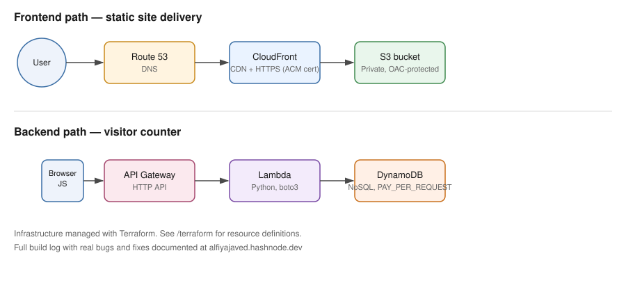

# Cloud Resume Challenge — Serverless Portfolio on AWS
 
A personal portfolio website built entirely on AWS managed and serverless services. This project is part of the Cloud Resume Challenge. It includes a live backend feature (a visitor counter), infrastructure managed as code with Terraform, and automated unit tests.
 
**Live site:** [alfiyajaved.in](https://alfiyajaved.in)

---
 
## About This Project
 
I built this to learn AWS by deploying something real, not just following theory. It started as a static portfolio site and grew to include a serverless backend, infrastructure as code, and automated testing. I am currently finishing the last parts of the infrastructure in Terraform and building a CI/CD pipeline next.
 
I document the real bugs and decisions behind this project on my blog: [alfiyajaved.hashnode.dev](https://alfiyajaved.hashnode.dev)
 
---

## Architecture
 

 
The project has two separate paths.
 
**Frontend path** — delivers the static site.
`User → Route 53 → CloudFront → S3`
 
**Backend path** — powers the visitor counter.
`Browser (JavaScript) → API Gateway → Lambda → DynamoDB`
 
The S3 bucket is private. It can only be reached through CloudFront, using Origin Access Control (OAC). The bucket cannot be accessed directly from the internet.
 
 ---


## Tech Stack
 
| Layer | Service | Purpose |
|---|---|---|
| Hosting | S3 | Stores the static site files (HTML, CSS, JS) |
| CDN | CloudFront | Delivers the site with caching and HTTPS |
| DNS | Route 53 | Points the domain to CloudFront |
| SSL/TLS | ACM | Provides the HTTPS certificate |
| API | API Gateway (HTTP API) | Exposes the visitor counter endpoint |
| Compute | Lambda (Python 3.14) | Runs the visitor counter logic |
| Database | DynamoDB | Stores the visitor count (on-demand billing) |
| Infrastructure as Code | Terraform | Manages AWS resources as code |
| Testing | pytest, unittest.mock | Tests the Lambda function without touching real AWS resources |

See [`MANUAL_ARCHITECTURE.md`](./MANUAL_ARCHITECTURE.md) for the full manual build notes.
 
---


## API Reference
 
| Method | Endpoint | Description | Response |
|---|---|---|---|
| GET | `/count` | Increments and returns the current visitor count | `{ "visitor_count": <number> }` |
 
---


## Highlights

- Integrated **4+ managed AWS services** (S3, CloudFront, Route 53, ACM, API Gateway, Lambda, DynamoDB) for a fully serverless, scalable setup — no servers to patch or manage.
- Built a **Python Lambda function** integrated with API Gateway and DynamoDB to deliver a real-time visitor counter — hands-on serverless, event-driven design.
- Configured **custom domain routing and HTTPS** via Route 53 and ACM; troubleshot DNS/SSL/TLS issues by isolating browser-level caching from infrastructure-layer problems, improving deployment reliability.
- **Under $1/month operating cost** by strategically selecting AWS free-tier services throughout.
- Currently **importing manually-created AWS resources into Terraform-managed state** — converting a console-first build into Infrastructure as Code.
- **GitHub Actions CI/CD** planned next.

## Repo Structure

```
├── Backend/       → Lambda function code (Python)
├── Frontend/       → Static site (HTML/CSS/JS)
├── Terraform/      → IaC — importing existing manual resources
├── .github/        → CI/CD workflows (in progress)
└── MANUAL_ARCHITECTURE.md → Full manual-build documentation + IAM policy
```

## Build Log

I'm documenting the full build process — including the manual-to-IaC migration — on [Hashnode](#).

## Tech Stack

AWS (S3, CloudFront, Route 53, ACM, API Gateway, Lambda, DynamoDB) · Python · Boto3 · Terraform · GitHub Actions