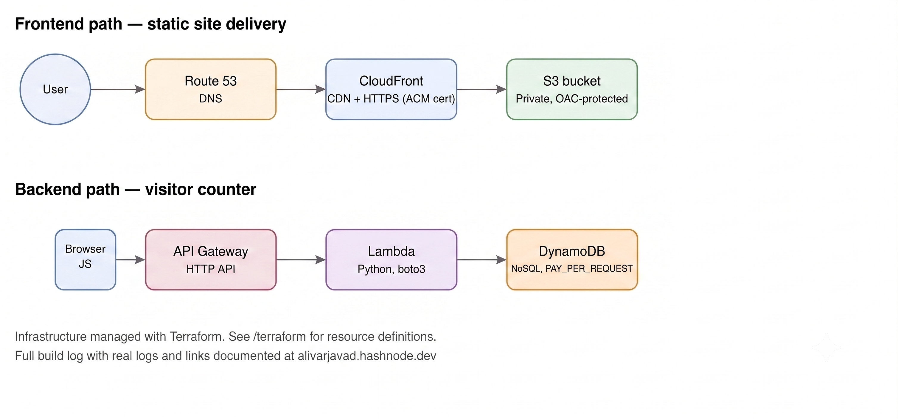
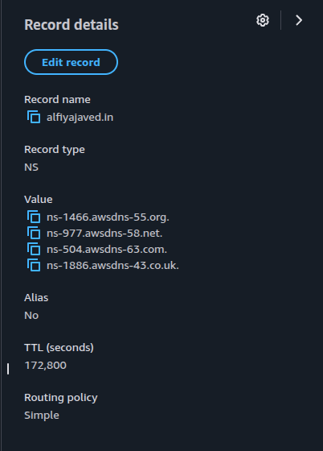
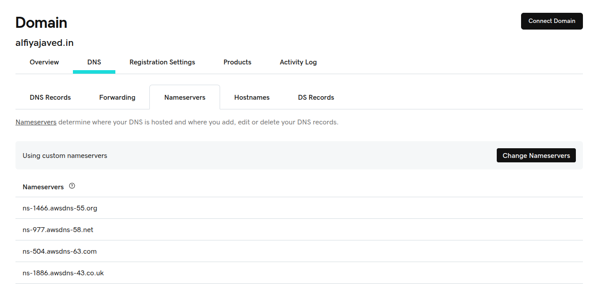
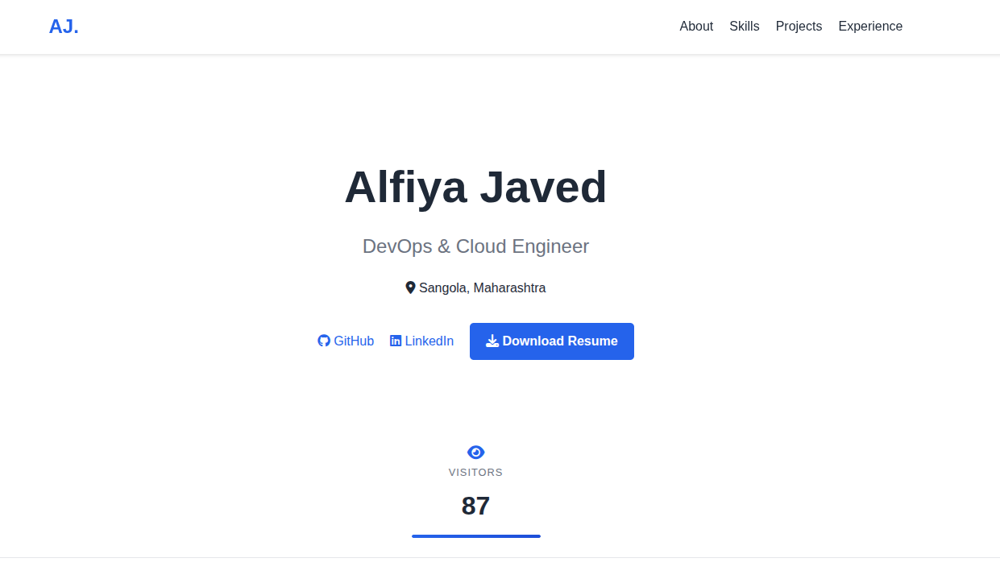
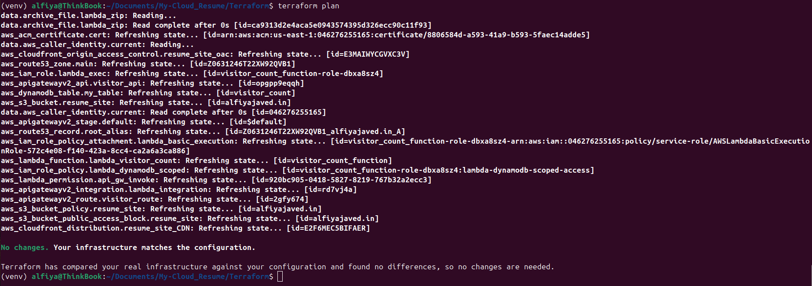
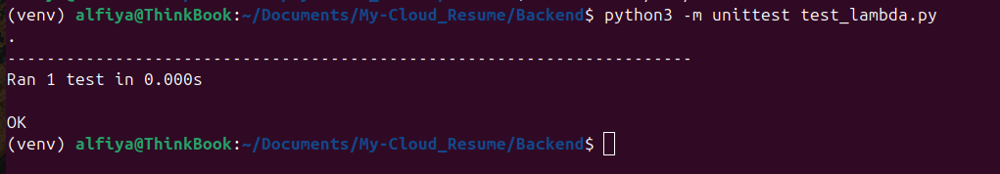

# Cloud Resume Challenge — Serverless Portfolio on AWS
 
A personal portfolio website built entirely on AWS managed and serverless services. This project is part of the Cloud Resume Challenge. It includes a live backend feature (a visitor counter), infrastructure managed as code with Terraform, and automated unit tests.
 
**Live site:** [alfiyajaved.in](https://alfiyajaved.in)


---
 

## About This Project
 
I built this to learn AWS by deploying something real, not just following theory. It started as a static portfolio site and grew to include a serverless backend, infrastructure as code, and automated testing. I am currently finishing the last parts of the infrastructure in Terraform and building a CI/CD pipeline next.
 
I document the real bugs and decisions behind this project on my blog: [alfiyajaved.hashnode.dev](https://alfiyajaved.hashnode.dev)
 

---


## Architecture
 

 
The project has two separate paths.
 
**Frontend path** — delivers the static site.
`User → Route 53 → CloudFront → S3`
 
**Backend path** — powers the visitor counter.
`Browser (JavaScript) → API Gateway → Lambda → DynamoDB`
 
The S3 bucket is private. It can only be reached through CloudFront, using Origin Access Control (OAC). The bucket cannot be accessed directly from the internet.
 


 ---


## Tech Stack
 
| Layer | Service | Purpose |
|---|---|---|
| Hosting | S3 | Stores the static site files (HTML, CSS, JS) |
| CDN | CloudFront | Delivers the site with caching and HTTPS |
| DNS | Route 53 | Points the domain to CloudFront |
| SSL/TLS | ACM | Provides the HTTPS certificate |
| API | API Gateway (HTTP API) | Exposes the visitor counter endpoint |
| Compute | Lambda (Python 3.14) | Runs the visitor counter logic |
| Database | DynamoDB | Stores the visitor count (on-demand billing) |
| Infrastructure as Code | Terraform | Manages AWS resources as code |
| Testing | pytest, unittest.mock | Tests the Lambda function without touching real AWS resources |

See [`MANUAL_ARCHITECTURE.md`](./MANUAL_ARCHITECTURE.md) for the full manual build notes.
 


---


## API Reference
 
| Method | Endpoint | Description | Response |
|---|---|---|---|
| GET | `/count` | Increments and returns the current visitor count | `{ "visitor_count": <number> }` |
 
---


## Project Structure
 
```
Cloud_Resume_Project
├── frontend/                 
│   ├── index.html             # HTML file
│   ├── style.css              # CSS file
│   └── visitor.js             # javascript file
├── Backend/
│   ├── lambda_function.py     # Lambda handler for the visitor counter
│   └── test_lambda.py         # Unit tests for the Lambda function
├── terraform/
│   ├── main.tf                # Resource definitions
│   ├── providers.tf           # Provider and version configuration
│   ├── outputs.tf             # Output values
│   ├── variables.tf           # variable declaration
│   └── 
│   └── build/                 # Generated Lambda deployment package (gitignored)
├── assets                     # Images 
│    
├── MANUAL_ARCHITECTURE.md     # Manual-build documentation
└── README.md
```

---
 

## Prerequisites
 
Install the following before deploying this project.
 
### Python
 
Python 3.14 is required, to match the Lambda runtime. Create and activate a virtual environment before running any Python commands:
 
```bash
python3 -m venv venv
source venv/bin/activate      # Linux / Mac
venv\Scripts\activate         # Windows
```
 
No external packages are required to run the tests, since boto3 is mocked directly inside the test file. If real dependencies are added later, list them in a `requirements.txt` file.

### AWS CLI
 
```bash
curl "https://awscli.amazonaws.com/awscli-exe-linux-x86_64.zip" -o "awscliv2.zip"
unzip awscliv2.zip
sudo ./aws/install
aws --version
```
 
For other operating systems, see the [official AWS CLI install guide](https://docs.aws.amazon.com/cli/latest/userguide/getting-started-install.html).
 
### Terraform
 
Terraform reads AWS credentials through the AWS CLI's profile system, so AWS CLI should be configured before Terraform is used.
 
```bash
sudo apt update && sudo apt install -y gnupg software-properties-common
wget -O- https://apt.releases.hashicorp.com/gpg | sudo gpg --dearmor -o /usr/share/keyrings/hashicorp-archive-keyring.gpg
echo "deb [signed-by=/usr/share/keyrings/hashicorp-archive-keyring.gpg] https://apt.releases.hashicorp.com $(lsb_release -cs) main" | sudo tee /etc/apt/sources.list.d/hashicorp.list
sudo apt update && sudo apt install terraform
terraform -version
```
 
For other operating systems, see the [official HashiCorp install guide](https://developer.hashicorp.com/terraform/downloads).
 
### A registered domain
 
This project uses a custom domain. The domain here was purchased through GoDaddy, but any registrar works — the setup only requires changing nameservers. See the Domain Setup section below.
 
### An AWS account
 
Required to create all resources in this project.
 
---
 
## Domain Setup (Connecting an External Domain to AWS)
 
If your domain is registered outside AWS — GoDaddy in this case — it needs to point to Route 53 before HTTPS and CloudFront will work with your custom domain. Start this step early, since DNS changes take time to propagate.
 
### 1. Create a Hosted Zone in Route 53
 
```bash
aws route53 create-hosted-zone --name yourdomain.com --caller-reference $(date +%s) --profile your-profile-name
```
 
This returns four nameserver (NS) values. Copy them.

 

*(Route 53 hosted zone page, showing the four NS records.)*
 
### 2. Update Nameservers at Your Registrar
 
Log in to your domain registrar. Go to the domain's DNS or nameserver settings, and replace the registrar's default nameservers with the four Route 53 gave you in step 1. This is called nameserver delegation — it tells the internet that Route 53, not your registrar, now controls this domain's DNS. In GoDaddy specifically, this is under **My Products → DNS → Nameservers → Change → Enter custom nameservers**.
 
 

*(GoDaddy nameserver settings panel, showing where to paste the custom nameservers.)*
 
### 3. Wait for Propagation
 
This can take a few minutes up to 48 hours, though it is usually much faster.
 
```bash
dig NS yourdomain.com
```
 
Or check [dnschecker.org](https://dnschecker.org) to see propagation status globally.
 
### 4. Verify
 
Once propagated, `dig NS yourdomain.com` should show the Route 53 nameservers, not the registrar's default ones.
 
Note: the ACM certificate and the CloudFront/Route 53 records themselves are still configured manually for this project (see Current Status below). Nameserver delegation needs to be complete before those steps will work correctly.
 
---
 
## Setup and Deployment
 
### 1. Clone the repository
 
```bash
git clone https://github.com/your-username/your-repo-name.git
cd your-repo-name
```
 
### 2. Configure AWS credentials
 
Create a dedicated IAM user with least-privilege access for Terraform, rather than using your root account. Then configure a named profile:
 
```bash
aws configure --profile your-profile-name
```
 
Verify it is working:
 
```bash
aws sts get-caller-identity --profile your-profile-name
```
 
Expected output shows the IAM user's ARN, not your root account.
 
### 3. Initialize Terraform
 
```bash
cd terraform
terraform init
```
 
### 4. Review the plan before applying anything
 
```bash
terraform plan
```
 
Read the output carefully. It should describe exactly what will be created or changed, with no unexpected destroys.
 
### 5. Apply
 
```bash
terraform apply
```
 
Type `yes` when prompted.
 
### 6. Verify the deployment
 
After `apply` finishes, confirm the site is actually working, not just that Terraform reported success:
 
```bash
curl https://your-api-url/count
```
 
Expected response:
 
```json
{ "visitor_count": 1 }
```
 
Then open the live domain in a browser and confirm the counter displays and increments on refresh.
 
---
 
## Running Tests
 
The Lambda function has unit tests that run without connecting to real AWS services. Boto3 is intercepted and mocked before the function is imported, so the tests never touch real data.
 
```bash
cd Backend
python3 -m unittest test_lambda.py
```
 
Expected output:
 
```
.
----------------------------------------------------------------------
Ran 1 test in 0.00Xs
 
OK
```
 
---
 
## Cost
 
This project runs at under $1 per month. It uses AWS's free-tier and pay-per-use services — S3, CloudFront, Lambda, API Gateway, and DynamoDB on-demand billing — so there is no fixed server cost.
 
---


## Current Status
 
This project is a work in progress. Here is what is actually done, and what is still coming.
 
**Done and managed with Terraform:**
- DynamoDB table
- S3 bucket, bucket policy, and public access settings
- IAM role and permissions for Lambda
- Lambda function
- API Gateway (API, integration, route, and stage)
- CloudFront distribution
- ACM certificate
- Route 53 records

**Planned next:**
- Add a CI/CD pipeline with GitHub Actions to deploy code changes automatically
- Reduce IAM permissions to follow least privilege more closely — the Lambda role currently has broader DynamoDB access than it needs
I am keeping this section honest and updated as the project progresses, instead of only showing the finished parts.
 
---
 
## Screenshots

 

*(Live site with visitor count visible.)*

 

*(A clean `terraform plan` showing "No changes.")*

 

*(Passing test output)*

 

*(The DynamoDB table in AWS Console.)*
 

 
---
 
## Build Log
 
I documented the real bugs, debugging steps, and decisions behind this project as I built it: [alfiyajaved.hashnode.dev](https://alfiyajaved.hashnode.dev)
 
---
 
## Author
 
**Alfiya Javed**
[LinkedIn](https://linkedin.com/in/alfiya-javed-5326a1235/) · [GitHub](https://github.com/02alfiya/) · [Portfolio](https://alfiyajaved.in)
 